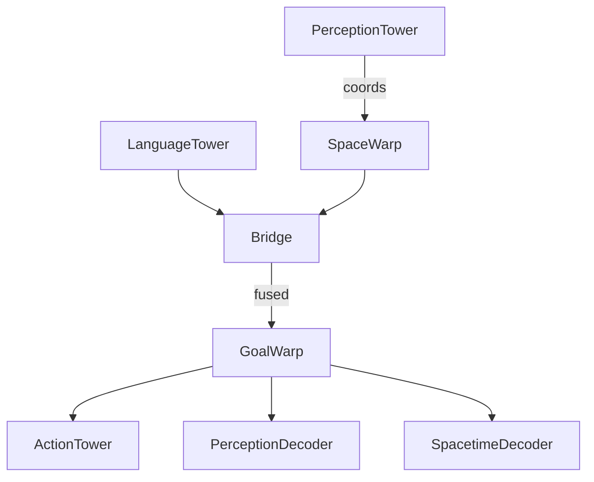

# Warp Modules Theory

> "Warp"は表象空間の計量をタスク依存で動的に再定義する仕組みです。
> 時間 (TimeWarp)・空間 (SpaceWarp)・不確実性 (Uncertainty Warp)・目的関数 (GoalWarp) を統合することで、
> Dreamer 型エージェントの探索効率と汎化を高めます。

---

## 1. 時間 Warp (TimeWarp)
`h_t' = h_t + \phi_θ(t)`
- 入力: スカラー時刻 `t∈R` (0 で現在)
- 実装: MLP(1→4096) 初期値ゼロ。
- 学習: α\*σ_u を加算し"不確実な時点"を拡大。

## 2. 空間 Warp (SpaceWarp)
`h' = h + ψ_θ(x, y)`
- 入力: 正規化 UI 座標 (x,y) ∈ [0,1]^2
- 用途: 視覚特徴へ座標バイアスを注入しクリック位置をエンコード。

## 3. 不確実性 Warp
`sigma_u = U(h) ≥0`   
`t_vec = t + α·σ_u`
- `σ_u` は TD-Error を教師信号に MSE で学習。
- 高 TD-Error 区間で TimeWarp が時間解像度を上げる。

## 4. Goal Warp (Real-NVP)
条件付き可逆フロー `z' = F_θ(z | g)`
- `g` は 16-dim ゴールベクトル: `[x,y, one-hot10, reserved4]`
- Affine coupling 層 ×4, 固定 permutation。
- Jacobian log|det J| を Actor と World-Model 損失へ正則化項として追加。

### 4.1 Jacobian 正則化
`L_goal = β · E[ log|det ∂F/∂z| ]`
- β は `training.loss_weights.goalwarp_logdet`。
- β warm-up スケジュールは config で指定可能。

## 5. Warp Vector 仕様 (16 dim)
| idx | 意味 |
|-----|------|
| 0-1 | クリック座標 (x,y) |
| 2-11| UI タグ one-hot (button,a,input,img,select,textarea,checkbox,radio,div,span) |
| 12-15 | 予約 (0 埋め) |

## 6. 学習プロセスとの関係図

## 7. 実装参照
- `models/warp_modules.py` – 各 Warp 実装。
- `models/gia_agent.py` – Warp 適用箇所。
- `engine/trainer.py` – Warp 損失と正則化。 